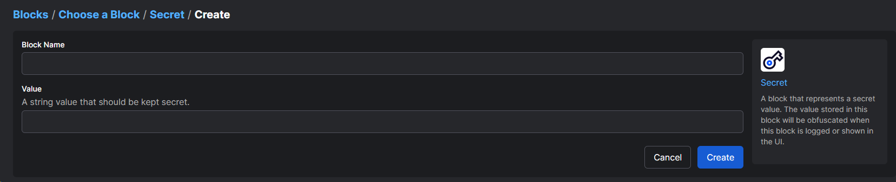
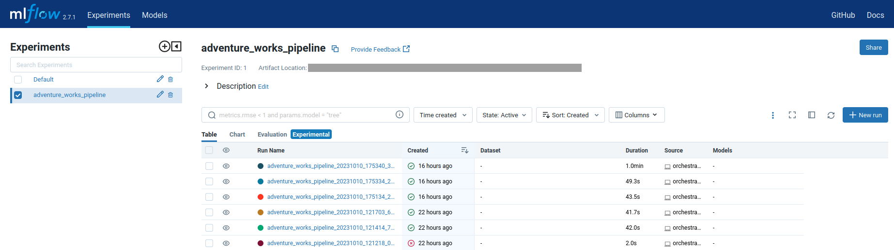
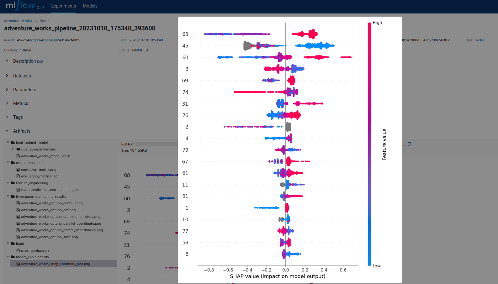
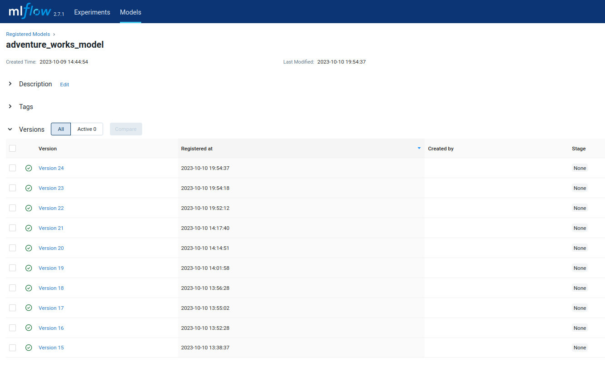
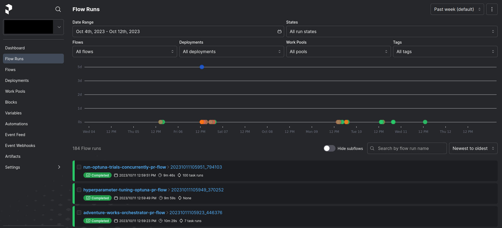
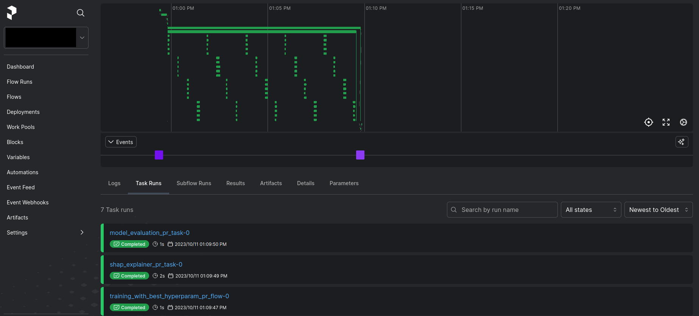

# Prefect POC - Adventure Works dataset

This directory corresponds to a Proof of Concept for a sample ML training pipeline orchestrated by Prefect locally.
This POC does not aim to create the most complete ML training pipeline, but to demonstrate that Prefect covers all
our needs for orchestration purposes, such as modularity, abstraction, concurrency, logging, monitoring, scheduling,
automation, among other benefits. We are using a sample public relational dataset: Adventure Works
(https://relational.fit.cvut.cz/dataset/AdventureWorks). No EDA or custom specific feature engineering has
been used for this dataset, instead we have focused on implementing generic tools that could be applied to start
generating baseline predictions right away with any relational dataset.

## Modules

Generic functionality for any ML training pipeline has been created under the `tools/` subfolder:
- `custom_logger.py`: Functionality to log seamlessly any Python library logs when running code locally or within
Prefect Flows and Tasks. Such a "hybrid" Prefect logger that can be used from both the run context and outside it
has not been implemented yet (as per in 2023-10-11, this is not covered in the log docs:
https://docs.prefect.io/2.13.5/guides/logs/, and there's still this related open issue:
https://github.com/PrefectHQ/prefect/issues/6767).
- `disk_interactions.py:` Prefect's Flow parameters can't exceed 512kb in size. Thus, we use disk as buffer
with the read / write functionality in this script.
- `mlflow_tools.py`: MLFlow experiment tracking and model versioning functionality.
- `mysql_connector.py`: Functionality to connect to a MySQL DB and execute queries.
- `featuretools_feat_engineering.py`: Wrapper of featuretools library to use Deep Feature Synthesis for automated
 feature engineering with any relational dataset.
- `feature_encoding.py`: Simple feature encoding wrapper.
- `models/abstract_model.py`: Abstract machine learning model.
- `models/lightgbm_model.py`: LightGBM model. New models can be created using the same functions as in the
 abstract model, similarly to how the LightGBM model has been implemented.
- `optuna_optimizer.py`: Hyperparameter tuning with Optuna.
- `metrics.py`: Metric definitions. Currently only sklearn metrics implemented, but it can be extended to any metrics.

The `adventure_works_pipeline/` subfolder contains all the logic specific to the Adventure Works dataset training
pipeline to predict churn:
- `configs/`: All the configurations for the pipeline, including:
     - `dataset_db_credentials.py`: DB credentials for the public Adventure Works dataset.
     - `dataset_info.py`: Dataset information to be able to link all the tables of the relational dataset for
       feature engineering purposes.
     - `main_config`: Main configuration of the pipeline.
- `pipeline_code/`: Logic for each module in the training pipeline:
     - `data_preprocessing.py`: Pulling data and computing churn.
     - `feature_engineering.py`: Feature engineering.
     - `feature_post_processing.py`: Feature post-processing (encoding features and labels).
     - `training_and_hyperparameter_tuning.py`: Training LightGBM model and hyperparameter tuning with Optuna.
     - `evaluation.py`: Compute evaluation metrics on the test set.
     - `model_explainability.py`: Model explainability with SHAP.
- `queries/`: Queries for some relevant tables in the Adventure Works dataset for predicting churn.
- `orchestrator.py`: Orchestrator to trigger the Prefect pipeline. You just need to run this script and the Adventure
  Works training pipeline will run in Prefect according to the parameters defined in the main configuration. Please,
  go over the next steps in this _README.md_ before triggering the pipeline.

## Prefect Cloud authentication

For this POC we have decided to use the Prefect Cloud _Free Forever_ account (https://www.prefect.io/pricing).
As per 2023-10-11, it includes 1 worspace and 3 users for free, and it saves us resources and time compared to
self-hosting. This is more than we need for this POC, but we could easily switch to self-hosting in a Postgres DB
in the future if required, as explained in: https://docs.prefect.io/2.13.5/guides/host/.

To run this POC, you just need to create the above-mentioned free account and authenticate to Prefect in the terminal
once with the `prefect cloud login` command. For more information regarding connecting to the Prefect API read this
section in the docs' Quickstart: https://docs.prefect.io/2.13.5/getting-started/quickstart/#step-2-connect-to-prefects-api.

## Poetry dependencies

We use Poetry to manage Python dependencies, please install it beforehand
(https://python-poetry.org/docs/#installationO). There is an optional Poetry dependency group for this Prefect POC.

You can install the dependencies with the following command from the root directory of the repository (_grizzly/_): 
`poetry install --with prefect_poc`

## MySQL DB for distributed hyperparameter tuning

We use Optuna with local DB storage, so that we can use Prefect capabilities to run multiple trials
concurrently. You can follow the steps below to create a MySQL DB locally and store the secrets in Prefect, which
only needs to be executed once. Alternatively, you can also use a PostgresSQL DB.

1) Create MySQL DB. Please modify and substitute the `<dbname>` parameter. 
`sudo mysql -u root -e 'CREATE DATABASE IF NOT EXISTS <dbname>'`

2) Log in to MySQL as the root user: 
`sudo mysql -u root -p`

3) Create a MySQL User with Limited Privileges.
   Please choose and substitute the `<username>` and `<password>` parameters (and the `<dbname>` parameter from step 1) 
`CREATE USER '<username>'@'localhost' IDENTIFIED BY '<password>';
GRANT ALL PRIVILEGES ON <dbname>.* TO '<username>'@'localhost';`

4) Exit MySQL: 
`exit;`

5) We will store the credentials as secrets in Prefect, to show this capability. In the Prefect UI go to the Secret
   blocks:

Then, add the following 3 blocks:
- mysql-local-dbname: `<dbname>`
- mysql-local-username: `<username>`
- mysql-local-password: `<password>`

## MLFlow tracking

Prefect has the capability to store persisted outputs as Artifacts (https://docs.prefect.io/2.13.5/concepts/artifacts/).
However, we prefer to use a widely adopted and open-source tool dedicated for experiment tracking and model
versioning, such as MLFlow. As mentioned above, the `tools/mlflow_tools.py` script provides all the MLFlow
functionality, and it has been incorporated in the Adventure Works pipeline code.

The Prefect pipeline will be tracked in MLFlow if the parameter `enable_mlflow_tracking` is set to True in the
main configuration. In such case, the artifacts and transactional data tracked will be stored locally in
`mlflow_local/` (in files and a SQLite DB respectively). To view the MLFlow UI locally, you just need to run
the script `tools/mlflow_tools.py`, where the `start_mlflow_ui()` function is called in the `__main__`. In the logs of
this script, you'll be prompted to go to `http://127.0.0.1:5000` to visualize the MLFlow UI.

In the UI you can view:

- The experiments run:

- The artifacts tracked for every run. For example, in this picture the SHAP summary plot is visualized. Note that
the values in the y-axis correspond to the feature numbers, whose description has also been included in MLFlow in the
`feature_engineering/featuretools_features_definition.json` folder.

- The model versions, which are linked to the experiment runs:

## Try it yourself!

At this point, you should have all the knowledge required to run the Adventure Works training pipeline in Prefect
by yourself. You can optionally modify the main config (`adventure_works_pipeline/configs/main_config.py`) and then
trigger the orchestrator: `adventure_works_pipeline/orchestrator.py`

You can now explore the Prefect Cloud UI to gain valuable insights, including:

- The history of Prefect Flow runs. The 3 Flows showed here correspond to the main orchestrator flows and subflows
required to run hyperparameter tuning in a distributed fashion.

- Everything related to a single Flow run, such as logs, tasks and subflow runs, input parameters, etc.

Also, feel free to implement this solution on your own relational dataset, by just modifying the code, configs
and queries in the `adventure_works_pipeline/` subfolder

## Future steps

The main goal for future steps of this POC is to run the pipeline on cloud workers, such as to AWS ECS
(https://prefecthq.github.io/prefect-aws/#using-prefect-with-aws-ecs). The infrastructure should be provisioned by code
using Pulumi. Finally, we should also deploy to a cloud provider via Pulumi:
- A DB for distributed hyperparameter tuning with Optuna.
- A DB and a simple storage service (such as S3) for the MLFlow remote tracking server.
- The disk interactions to pass data to subflows should be handled via a simple storage service as well.
